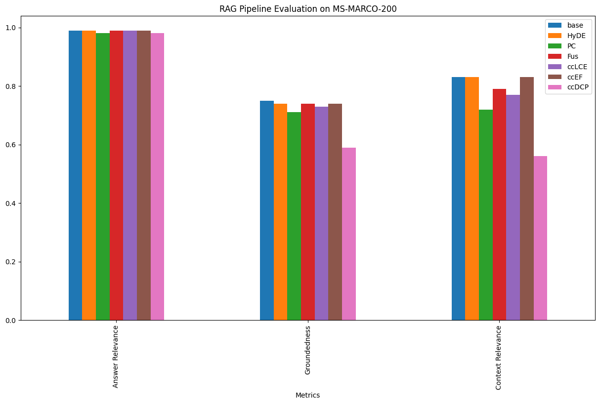
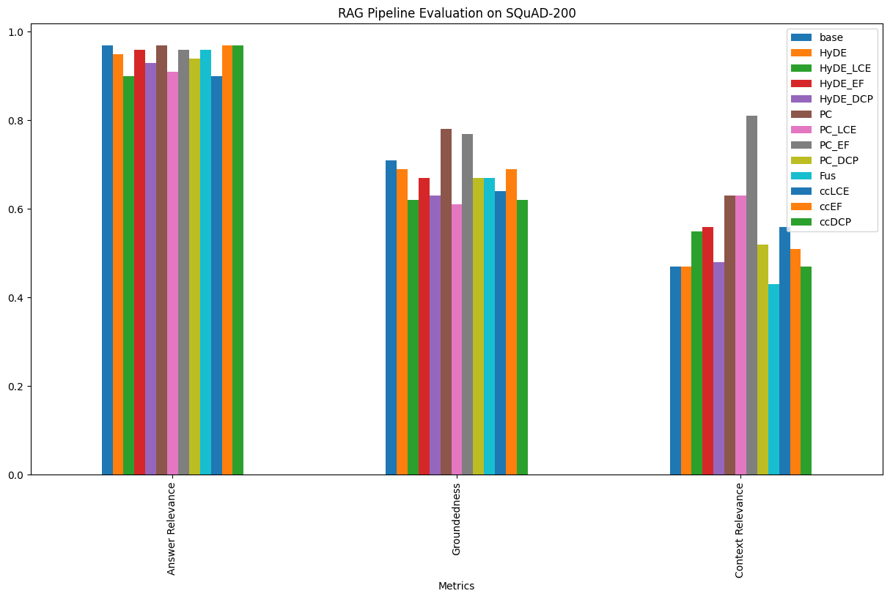
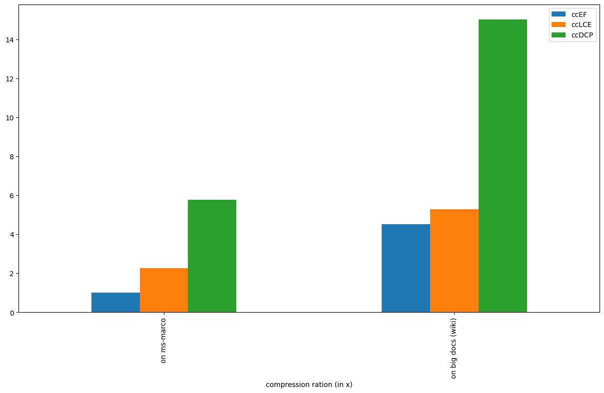

# Contextual-Compression
Contextual compression for RAG-based applications.

### Steps to install and run:

1. Clone this repo
2. Install the requirements
    ```
    pip install -r venv_requirements.txt
    ```
3. Make a .env file in the root folder with the following credentials:
    ```
    API_KEY='IBM_cloud_API_Key' or, any other LLM API keys of your choice. make proper initialization
    PROJECT_ID=<Watsonx_Project_id>
    IBM_CLOUD_URL='IBM cloud url'  # Change the URL according to your region.
    GENAI_KEY=<BAM_API_Key>
    GENAI_API=https://bam-api.res.ibm.com
    ```
4. Run the main.py file or, experiment with any other

### Simple RAG


<br><br>


`Limitations`

One problem with this approach is that when you ingest data into your document storage system, you often don’t know what specific queries will be used to retrieve those documents. In our notes Q&A example, we simply partitioned our text into equally sized chunks. That means that when we get a specific user question and retrieve a document, even if the document has some relevant text it likely has some irrelevant text as well.

Inserting irrelevant information into the LLM prompt is bad because:

- It might distract the LLM from the relevant information
- It takes up precious space that could be used to insert other relevant information.
<br>

`Methods to improve`
- Chunking strategies
- Cleaning data
- Prompt engineering
- picking up a better domain-specific embedding model
- Fine Tuning of embedding model
- Compressing the context


### Contextual Compression

 
<br><br>

The idea is simple: instead of immediately returning retrieved documents as-is, you can compress them using the context of the given query, so that only the relevant information is returned. “Compressing” here refers to both compressing the contents of an individual document and filtering out documents wholesale.

`Approaches (experimented)`
- LangChain
    - base_compressor 
        - LLMChainExtractor
        - EmbeddingsFilter
        - DocumentCompressorPipeline
- LLmLingua
    - LongLLMLinguaPostprocessor (takes time to process)
- In-context auto-encoder: https://arxiv.org/pdf/2307.06945.pdf
- Semantic compression using topic modeling: https://arxiv.org/pdf/2312.09571.pdf 
- and many more...

Note: the last 2 methods need pre-trained models. 

`How do these work?`

To use the Contextual Compression Retriever, you’ll need: 
- a base retriever & 
- a Document Compressor

The Contextual Compression Retriever passes queries to the base retriever, takes the initial documents, and passes them through the Document Compressor. The Document Compressor takes a list of documents and shortens it by reducing the contents of documents or dropping documents altogether.

1) Langchain's - 

    Create a base retriever using any vector store (FAISS is being used here), next ...

    - `Contextual compression with an LLMChainExtractor​`

        We’ll wrap our base retriever with a ContextualCompressionRetriever. We’ll add an LLMChainExtractor, which will iterate over the initially returned documents and extract from each only the content that is relevant to the query.
        ```
        compressor = LLMChainExtractor.from_llm(llm)
        compression_retriever = ContextualCompressionRetriever(
            base_compressor=compressor, base_retriever=retriever
        )
        compressed_docs = compression_retriever.get_relevant_documents(
            query_str
        )
        ```
    - `Contextual compression with an EmbeddingsFilter`

        Making an extra LLM call over each retrieved document is expensive and slow. The EmbeddingsFilter provides a cheaper and faster option by embedding the documents and query and only returning those documents that have sufficiently similar embeddings to the query.
        ```
        embeddings = HuggingFaceBgeEmbeddings() # could be any embedding of your choice
        embeddings_filter = EmbeddingsFilter(embeddings=embeddings, similarity_threshold=0.76)
        compression_retriever = ContextualCompressionRetriever(
            base_compressor=embeddings_filter, base_retriever=retriever
        )
        compressed_docs = compression_retriever.get_relevant_documents(
            query_str
        )
        ```
    - `Stringing compressors and document transformers together - DocumentCompressorPipeline`

        Using the DocumentCompressorPipeline we can also easily combine multiple compressors in sequence. Along with compressors, we can add BaseDocumentTransformers to our pipeline, which don’t perform any contextual compression but simply perform some transformation on a set of documents. For example, TextSplitters can be used as document transformers to split documents into smaller pieces, and the EmbeddingsRedundantFilter can be used to filter out redundant documents based on embedding similarity between documents.

        - splitter (create small chunks)
        - redundant filter (remove similar docs — embedded)
        - relevant filter (relevant to query)
        ```
        embeddings = HuggingFaceBgeEmbeddings()
        splitter = CharacterTextSplitter(chunk_size=100, chunk_overlap=0, separator=". ")
        redundant_filter = EmbeddingsRedundantFilter(embeddings=embeddings)
        relevant_filter = EmbeddingsFilter(embeddings=embeddings, similarity_threshold=0.76)
        pipeline_compressor = DocumentCompressorPipeline(
            transformers=[splitter, redundant_filter, relevant_filter]
        )
        compression_retriever = ContextualCompressionRetriever(
            base_compressor=pipeline_compressor, base_retriever=retriever
        )
        compressed_docs = compression_retriever.get_relevant_documents(
            query_str
        )
        ```
2) LLMLingua: `LongLLMLinguaPostprocessor`

    There are 3 components to it:

    a) `Budget controller (use smaller LLMs e.g. GPT-2, Llama, etc.)`
        
    calculate perplexity, which is the surprise factor, (calculated as the Exp of the mean of log-likelihood of all the words in the input sequence) of each context chunk or, demonstration. Use the highest valued ones.

    b) `Iterative token level prompt compression algorithm (ITPC)`

    - segment the prompt
    - use small LLMs to determine perplexity distribution across these segments
    - retain tokens with high perplexity — ensuring key info is present by considering the conditional dependence between the tokens

    c) instruction tuning-based method that syncs the distribution patterns of the large and small language models (optional)

    ```
    # Create a base retriever and retrieve base nodes
    <>

    # Setup LLMLingua
    from llama_index.indices.postprocessor import LongLLMLinguaPostprocessor

    node_postprocessor = LongLLMLinguaPostprocessor(
        device_map='cpu',
        instruction_str="Given the context, please answer the final question",
        target_token=300,
        rank_method="longllmlingua",
        additional_compress_kwargs={
            "condition_compare": True,
            "condition_in_question": "after",
            "context_budget": "+100",
            "reorder_context": "sort",  # enable document reorder,
            "dynamic_context_compression_ratio": 0.3,
        },
    )

    from llama_index.indices.query.schema import QueryBundle

    new_retrieved_nodes = node_postprocessor.postprocess_nodes(
        retrieved_nodes, query_bundle=QueryBundle(query_str)
    )
    ```

### Dataset used to test and evaluate
- MS-MARCO-200, SQuAD-200

### Evaluation results: (ref - main.py)

<br><br>


<br><br>


<!-- |   |Retriever	                   |Reranker	            |recall	           |precision	      |f1         |
|---|----------------------------- |----------------------- |----------------- |------------------|---------- | 
|0	|baseline_FAISS	               |without_reranker	    |45.472579	       |54.085855	      |49.406629  |
|1	|baseline_FAISS	               |bge_reranker_base	    |44.633456	       |53.807125	      |48.792844  |
|2	|baseline_FAISS	               |colbert2.0	            |45.916832	       |58.463963	      |51.436281  |
|3	|cc_llmChainExtractor	       |without_reranker	    |47.070420	       |61.306926	      |53.253616  |
|4	|cc_llmChainExtractor	       |bge_reranker_base	    |43.665858	       |57.094742	      |49.485432  |
|5	|cc_llmChainExtractor	       |colbert2.0	            |45.205592	       |58.454291	      |50.983288  |
|6	|cc_embeddingsFilter	       |without_reranker	    |45.567472	       |56.506424	      |50.450801  |
|7	|cc_embeddingsFilter	       |bge_reranker_base	    |NaN	           |NaN	              |NaN        |
|8	|cc_embeddingsFilter	       |colbert2.0	            |45.927817	       |59.433381	      |51.815004  |
|9	|cc_docCompressorPipeline	   |without_reranker	    |43.942254	       |57.837087	      |49.941215  |
|10	|cc_docCompressorPipeline	   |bge_reranker_base	    |NaN	           |NaN	              |NaN        |
|11	|cc_docCompressorPipeline	   |colbert2.0	            |45.279092	       |55.167481	      |49.736559  | -->

### Context Compression Comparision with the baseline (1x):

<br><br>
<!-- |       |compressor	                   |compression ratio on ms-marco |compression ratio on big docs (wiki) |
|-------|------------------------------|------------------------------|-------------------------------------|
|0	    |LLMChainExtractor	           |2.26x	                      |5.29x                                |
|1	    |EmbeddingsFilter	           |1.01x	                      |4.53x                                |
|2	    |DocumentCompressorPipeline	   |5.77x	                      |15.04x                               | -->

<br>

`Do make Pull Requests to contribute to this asset ✨`
